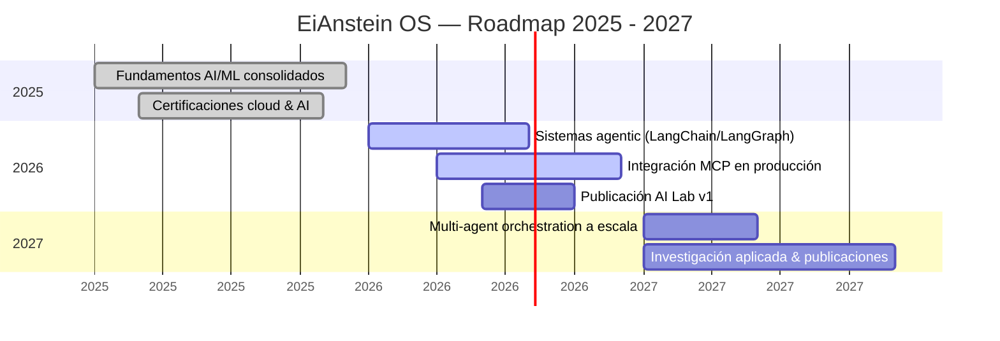

<!--
  ════════════════════════════════════════════════════════════════════════
  EiAnstein OS — GitHub Profile README
  ────────────────────────────────────────────────────────────────────────
  Autor: Isela
  Descripción: README interactivo estilo "sistema operativo de IA".
  Compatibilidad: 100% GitHub Flavored Markdown + HTML permitido por GitHub.
  Sin JavaScript. Sin frameworks. Sin dependencias externas de build.

  VARIANTE: HERO ESTÁTICO
  Este archivo usa assets/banner_cover.png como imagen principal del Hero
  Banner (Sección 1) en lugar del banner_svg.svg animado. El resto del
  sistema es idéntico a README.md. Si prefieres el hero animado, usa
  README.md en su lugar.

  INSTRUCCIONES RÁPIDAS:
  1. Reemplaza todas las apariciones de "USERNAME" por tu usuario real de GitHub.
  2. Coloca los archivos de /assets en la raíz de tu repo "USERNAME/USERNAME".
  3. Reemplaza los marcadores <!-- PROJECT_X_... --> con tus proyectos reales.
  4. Activa el workflow .github/workflows/snake.yml (ver Sección 10).
  ════════════════════════════════════════════════════════════════════════
-->

<div align="center">

<!-- ============================================================ -->
<!-- SECCIÓN 1 · HERO BANNER (VERSIÓN ESTÁTICA)                    -->
<!-- Banner PNG fijo — alternativa sin animación al banner_svg.svg -->


<!-- ============================================================ -->


<!-- Typing SVG animado — texto rotativo estilo terminal de IA -->


<br/>

<!-- Badge de estado del sistema -->


<br/>

<!-- Botones de navegación rápida (funcionan como anchors internos) -->
<p>
  <a href="#-2--introducción--whoami"></a>
  <a href="#-9--featured-projects"></a>
  <a href="#-16--contacto"></a>
</p>

</div>

<br/>

<!-- ============================================================ -->
<!-- ÍNDICE · TABLE OF CONTENTS                                    -->
<!-- Navegación rápida por todos los módulos del sistema           -->
<!-- ============================================================ -->

<details>
<summary><b>📂 system_index.map</b> — Tabla de contenidos (clic para expandir)</summary>

<br/>

| # | Módulo | Descripción |
|:--:|:--|:--|
| 01 | [Hero Banner](#-1--hero-banner) | Pantalla de arranque del sistema |
| 02 | [Introducción · whoami](#-2--introducción--whoami) | Presentación de Isela |
| 03 | [Recruiter Mode](#️-3--recruiter-mode) | Menú interactivo para reclutadores |
| 04 | [Mission Brief](#-4--mission-brief) | Resumen profesional |
| 05 | [Current Mission](#-5--current-mission) | Estado del objetivo activo |
| 06 | [Skill Tree](#-6--skill-tree) | Árbol de habilidades técnicas |
| 07 | [Tecnologías](#-7--tecnologías) | Stack técnico completo |
| 08 | [Certificaciones](#-8--certificaciones) | Credenciales verificadas |
| 09 | [Featured Projects](#-9--featured-projects) | Proyectos destacados |
| 10 | [Mission Control](#️-10--mission-control) | Estadísticas y actividad |
| 11 | [AI Lab](#-11--ai-lab) | Experimentos en fase de investigación |
| 12 | [Ecosystem](#-12--ecosystem) | Mapa del ecosistema personal |
| 13 | [Timeline](#️-13--timeline) | Roadmap 2025 – 2027 |
| 14 | [Terminal Commands](#️-14--terminal-commands) | Comandos de referencia |
| 15 | [Engineering Principles](#-15--engineering-principles) | Filosofía de ingeniería |
| 16 | [Contacto](#-16--contacto) | Canales de contacto |
| 17 | [Footer](#) | Cierre del sistema |

</details>

<br/>

<!-- ============================================================ -->
<!-- SECCIÓN 1B · BOOT SEQUENCE                                    -->
<!-- Secuencia de arranque simulada, estilo BIOS / Jarvis          -->
<!-- ============================================================ -->

```bash
[ EiAnstein-OS ] boot_sequence.sh --verbose

[ 0.001s ] Loading kernel modules ................ [ OK ]
[ 0.043s ] Mounting /home/isela/knowledge .......... [ OK ]
[ 0.112s ] Initializing neural_core.py ............. [ OK ]
[ 0.198s ] Calibrating LLM inference engine ........ [ OK ]
[ 0.276s ] Starting recruiter_mode.daemon .......... [ OK ]
[ 0.301s ] Verifying credentials & certifications .. [ OK ]
[ 0.355s ] Establishing secure API connection ...... [ OK ]

SYSTEM READY. Type 'whoami' to continue.
```

<br/>

<!-- ============================================================ -->
<!-- SECCIÓN 2 · INTRODUCCIÓN · WHOAMI                             -->
<!-- Terminal simulada presentando a Isela                         -->
<!-- ============================================================ -->

## 💻 2 · Introducción · `whoami`

<div align="center">

</div>

```bash
isela@eianstein-os:~$ whoami
```

```yaml
user:        Isela
role:        Ingeniera de Software · AI Engineer
focus:       Sistemas de Inteligencia Artificial & Redes Neuronales Aplicadas
core_stack:  Python · FastAPI · LangChain · LangGraph · MCP · LLMs
mission:     Diseñar e implementar sistemas de IA robustos, explicables
             y listos para producción — desde el modelo hasta la
             experiencia del usuario final.
status:      ● ONLINE — Open to new opportunities
```

```bash
isela@eianstein-os:~$ echo "Construyendo inteligencia artificial con propósito."
> Construyendo inteligencia artificial con propósito.
```

<br/>

<!-- ============================================================ -->
<!-- SECCIÓN 3 · RECRUITER MODE                                    -->
<!-- Terminal interactiva simulada con menú de navegación          -->
<!-- ============================================================ -->

## 🛰️ 3 · Recruiter Mode

<details>
<summary><b>▶ Ejecutar <code>recruiter_mode.sh</code></b> — haz clic para desplegar el menú interactivo</summary>

<br/>

```bash
isela@eianstein-os:~$ ./recruiter_mode.sh

┌──────────────────────────────────────────────┐
│           EiAnstein OS · MAIN MENU            │
├──────────────────────────────────────────────┤
│  [1] Projects   → Ver proyectos destacados    │
│  [2] Resume     → Descargar CV / Portfolio    │
│  [3] AI Lab     → Explorar experimentos de IA │
│  [4] Contact    → Canales de contacto directo │
└──────────────────────────────────────────────┘

Selecciona una opción [1-4]:
```

| Opción | Comando | Acceso directo |
|:---:|:---|:---|
| `1` | Projects | [→ Ir a Featured Projects](#-9--featured-projects) |
| `2` | Resume | [→ Descargar Resume](#-16--contacto) |
| `3` | AI Lab | [→ Ir a AI Lab](#-11--ai-lab) |
| `4` | Contact | [→ Ir a Contacto](#-16--contacto) |

</details>

<br/>

<!-- ============================================================ -->
<!-- SECCIÓN 4 · MISSION BRIEF                                     -->
<!-- Descripción profesional — máximo 5 bullets                    -->
<!-- ============================================================ -->

## 📡 4 · Mission Brief

> - 🧠 Ingeniera de Software especializada en el diseño y despliegue de sistemas de Inteligencia Artificial de extremo a extremo.
> - ⚙️ Experiencia construyendo APIs de alto rendimiento y arquitecturas de agentes con LangChain, LangGraph y protocolos MCP.
> - 🔍 Enfoque en LLMs aplicados a casos de uso reales: automatización, visión por computadora y sistemas de decisión.
> - ☁️ Despliegue de soluciones de IA en infraestructura cloud (Oracle Cloud, contenedores Docker).
> - 🎯 Orientada a resultados medibles, código mantenible y experiencias de producto centradas en el usuario.

<br/>

<!-- ============================================================ -->
<!-- SECCIÓN 5 · CURRENT MISSION                                   -->
<!-- Tarjeta de misión activa con versión, progreso y roadmap      -->
<!-- ============================================================ -->

## 🎯 5 · Current Mission

<table width="100%">
<tr>
<td>

```yaml
mission:       "Deploy Agentic AI Systems at Scale"
version:       v2.4.0-beta
progress:      ▓▓▓▓▓▓▓▓▓▓▓▓░░░░░░░░  58%
next_release:  v2.5.0 — "Multi-Agent Orchestration"
eta:           Q4 2026
roadmap:
  - [x] Diseño de arquitectura base de agentes
  - [x] Integración de MCP (Model Context Protocol)
  - [ ] Orquestación multi-agente con LangGraph
  - [ ] Observabilidad y trazabilidad de agentes
  - [ ] Publicación de caso de estudio técnico
status:        🟢 ACTIVE
```

</td>
</tr>
</table>

<br/>

<!-- ============================================================ -->
<!-- SECCIÓN 6 · SKILL TREE                                        -->
<!-- Árbol de habilidades estilo videojuego, por niveles/tiers     -->
<!-- Estados: 🟢 Unlocked · 🟡 In Progress · 🔴 Locked              -->
<!-- ============================================================ -->

## 🌳 6 · Skill Tree

```text
                          ┌────────────────────────┐
                          │      SKILL TREE          │
                          │   EiAnstein OS v2.4.0     │
                          └────────────┬─────────────┘
                                       │
   ══════════════════════════════ TIER 1 ══════════════════════════════
   FOUNDATIONS
   │
   ├── [🟢 UNLOCKED]    Python              ▓▓▓▓▓▓▓▓▓▓  100%
   ├── [🟢 UNLOCKED]    Docker              ▓▓▓▓▓▓▓▓░░   85%
   └── [🟢 UNLOCKED]    Oracle Cloud        ▓▓▓▓▓▓▓░░░   70%
                                       │
   ══════════════════════════════ TIER 2 ══════════════════════════════
   AI ENGINEERING
   │
   ├── [🟢 UNLOCKED]    Machine Learning    ▓▓▓▓▓▓▓▓▓░   90%
   ├── [🟢 UNLOCKED]    FastAPI             ▓▓▓▓▓▓▓▓▓░   90%
   ├── [🟡 IN PROGRESS] Computer Vision     ▓▓▓▓▓░░░░░   50%
   └── [🟡 IN PROGRESS] LLMs                ▓▓▓▓▓▓░░░░   60%
                                       │
   ══════════════════════════════ TIER 3 ══════════════════════════════
   AGENTIC SYSTEMS  (requiere Tier 2 completo)
   │
   ├── [🟡 IN PROGRESS] LangChain           ▓▓▓▓▓▓░░░░   60%
   ├── [🟡 IN PROGRESS] LangGraph           ▓▓▓▓░░░░░░   40%
   └── [🔴 LOCKED]       MCP                 ░░░░░░░░░░  0% — requiere LangGraph ≥ 70%
```

<br/>

<div align="center">

| Skill | Estado | Nivel |
|:--|:--:|:--|
| 🐍 Python | 🟢 Unlocked | `██████████` 100% |
| 🐳 Docker | 🟢 Unlocked | `████████░░` 85% |
| ☁️ Oracle Cloud | 🟢 Unlocked | `███████░░░` 70% |
| 🤖 Machine Learning | 🟢 Unlocked | `█████████░` 90% |
| ⚡ FastAPI | 🟢 Unlocked | `█████████░` 90% |
| 👁️ Computer Vision | 🟡 In Progress | `█████░░░░░` 50% |
| 🧠 LLMs | 🟡 In Progress | `██████░░░░` 60% |
| 🔗 LangChain | 🟡 In Progress | `██████░░░░` 60% |
| 🕸️ LangGraph | 🟡 In Progress | `████░░░░░░` 40% |
| 🔌 MCP | 🔴 Locked | `░░░░░░░░░░` — |

</div>

<br/>

**Leyenda de estados**

| Símbolo | Estado | Significado |
|:--:|:--|:--|
| 🟢 | `UNLOCKED` | Dominio consolidado, aplicado en proyectos productivos |
| 🟡 | `IN PROGRESS` | Aprendizaje activo, aplicado en proyectos experimentales |
| 🔴 | `LOCKED` | Pendiente de desbloquear — requiere completar prerequisitos del tier anterior |

<br/>

<!-- ============================================================ -->
<!-- SECCIÓN 7 · TECNOLOGÍAS                                       -->
<!-- Badges modernos agrupados por categoría                       -->
<!-- ============================================================ -->

## 🧩 7 · Tecnologías

<div align="center">

**Lenguajes**


**IA / Machine Learning**


**Agentic AI / LLMOps**


**Backend & APIs**


**Infraestructura & Cloud**


**Datos**


</div>

<br/>

<!-- ============================================================ -->
<!-- SECCIÓN 8 · CERTIFICACIONES                                   -->
<!-- ============================================================ -->

## 🎓 8 · Certificaciones

<div align="center">

| Emisor | Certificación | Estado |
|:--|:--|:--:|
|  | <!-- NOMBRE_CERTIFICACIÓN_GOOGLE --> | ✅ |
|  | <!-- NOMBRE_CERTIFICACIÓN_IBM --> | ✅ |
|  | <!-- NOMBRE_CERTIFICACIÓN_ORACLE --> | ✅ |
|  | <!-- NOMBRE_CERTIFICACIÓN_MICROSOFT --> | ✅ |
|  | <!-- NOMBRE_CERTIFICACIÓN_CISCO --> | ✅ |
| <!-- LOGO_EMISOR_ADICIONAL --> | <!-- NOMBRE_CERTIFICACIÓN_ADICIONAL --> | ⏳ |

</div>

> 💡 Reemplaza cada marcador `<!-- NOMBRE_CERTIFICACIÓN_... -->` con el nombre real y, si lo deseas, enlaza el badge a la credencial verificable.

**Formato recomendado para credenciales verificables**

```markdown
|  | [Google Cloud Professional ML Engineer](TU_URL_DE_VERIFICACIÓN) | ✅ |
```

> 🔐 Enlazar cada certificación a su URL de verificación (Credly, Coursera, Google Cloud Skills Boost, etc.) aumenta la confianza del reclutador y refuerza tu perfil ante sistemas ATS.

<br/>

<!-- ============================================================ -->
<!-- SECCIÓN 9 · FEATURED PROJECTS                                 -->
<!-- Tarjetas futuristas de proyectos — NO se inventan proyectos.  -->
<!-- Duplica el bloque <table> para añadir más proyectos.          -->
<!-- ============================================================ -->

## 🚀 9 · Featured Projects

<!-- ─────────────────── PROJECT CARD · 01 ─────────────────── -->
<table width="100%">
<tr>
<td width="160" align="center" valign="top">

<br/><sub>Espacio para GIF demo</sub>
</td>
<td valign="top">

### 🛰️ <!-- PROJECT_1_NAME -->

| Campo | Detalle |
|:--|:--|
| **ID** | `PRJ-001` |
| **Estado** |  |
| **Arquitectura** | <!-- PROJECT_1_ARCHITECTURE --> |
| **Tecnologías** | <!-- PROJECT_1_TECH_STACK --> |

<a href="<!-- PROJECT_1_REPO_URL -->"></a>

</td>
</tr>
</table>

<br/>

<!-- ─────────────────── PROJECT CARD · 02 ─────────────────── -->
<table width="100%">
<tr>
<td width="160" align="center" valign="top">

<br/><sub>Espacio para GIF demo</sub>
</td>
<td valign="top">

### 🧠 <!-- PROJECT_2_NAME -->

| Campo | Detalle |
|:--|:--|
| **ID** | `PRJ-002` |
| **Estado** |  |
| **Arquitectura** | <!-- PROJECT_2_ARCHITECTURE --> |
| **Tecnologías** | <!-- PROJECT_2_TECH_STACK --> |

<a href="<!-- PROJECT_2_REPO_URL -->"></a>

</td>
</tr>
</table>

<br/>

<!-- ─────────────────── PROJECT CARD · 03 ─────────────────── -->
<table width="100%">
<tr>
<td width="160" align="center" valign="top">

<br/><sub>Espacio para GIF demo</sub>
</td>
<td valign="top">

### 👁️ <!-- PROJECT_3_NAME -->

| Campo | Detalle |
|:--|:--|
| **ID** | `PRJ-003` |
| **Estado** |  |
| **Arquitectura** | <!-- PROJECT_3_ARCHITECTURE --> |
| **Tecnologías** | <!-- PROJECT_3_TECH_STACK --> |

<a href="<!-- PROJECT_3_REPO_URL -->"></a>

</td>
</tr>
</table>

> 🧩 Para añadir más proyectos, copia cualquiera de los bloques `<table>` anteriores y actualiza sus marcadores.

<br/>

<!-- ============================================================ -->
<!-- SECCIÓN 10 · MISSION CONTROL                                  -->
<!-- Stats, lenguajes, contribuciones, trophy, snake               -->
<!-- ============================================================ -->

## 🖥️ 10 · Mission Control


<br/>

<div align="center">


<br/>


<br/>


<br/>

<!-- Snake Animation — generado automáticamente por GitHub Actions -->
<!-- Ver Sección "snake.yml" para el workflow que lo genera -->


</div>

<br/>

<!-- ============================================================ -->
<!-- SECCIÓN 11 · AI LAB                                           -->
<!-- Laboratorio de experimentos — proyectos en fase exploratoria  -->
<!-- ============================================================ -->

## 🧪 11 · AI Lab

```text
┌──────────────────────────────────────────────────────────────┐
│  AI LAB — EXPERIMENTAL BRANCH                                  │
│  Estado: sandbox / research-only · no producción                │
└──────────────────────────────────────────────────────────────┘
```

<div align="center">

| Experimento | Categoría | Estado |
|:--|:--:|:--:|
| <!-- AI_LAB_EXPERIMENTO_1 --> | Agentic AI | 🧪 Research |
| <!-- AI_LAB_EXPERIMENTO_2 --> | Computer Vision | 🧪 Research |
| <!-- AI_LAB_EXPERIMENTO_3 --> | RAG / Retrieval | 🧪 Research |

</div>

> 🔬 Espacio reservado para experimentos, notebooks y pruebas de concepto reales. Sustituye los marcadores con tus proyectos del AI Lab.

**Convención sugerida para el repositorio del AI Lab**

```text
ai-lab/
├── experiments/
│   ├── 001-agentic-retrieval/
│   ├── 002-vision-pipeline/
│   └── 003-rag-benchmark/
├── notebooks/
└── README.md   → índice de experimentos con estado y hallazgos
```

<br/>

<!-- ============================================================ -->
<!-- SECCIÓN 12 · ECOSYSTEM                                        -->
<!-- Diagrama ASCII del ecosistema de marca personal / proyectos   -->
<!-- ============================================================ -->

## 🌐 12 · Ecosystem

```text
                             ┌───────────────────────────┐
                             │        EiAnstein OS         │
                             │   (Core Identity / AI Hub)  │
                             └──────────────┬───────────────┘
              ┌───────────────┬─────────────┼─────────────┬────────────────┐
              │               │             │             │                │
       ┌──────▼──────┐ ┌──────▼──────┐┌─────▼─────┐┌──────▼──────┐ ┌───────▼───────┐
       │  Portfolio   │ │   CorpIA     ││  AI Lab    ││  Research   │ │    GitHub      │
       │  (web site)  │ │ (producto IA)││(experimentos)│(publicaciones)│ (código fuente) │
       └──────────────┘ └──────────────┘└────────────┘└─────────────┘ └───────┬────────┘
                                                                                │
                                                              ┌─────────────────┴────────────────┐
                                                        ┌──────▼──────┐                  ┌─────────▼────────┐
                                                        │   YouTube    │                  │      Medium       │
                                                        │  (video/demo)│                  │ (artículos técnicos)│
                                                        └──────────────┘                  └───────────────────┘
```

<br/>

<!-- ============================================================ -->
<!-- SECCIÓN 13 · TIMELINE / ROADMAP                               -->
<!-- Diagrama Mermaid tipo Gantt — soportado nativamente en GitHub -->
<!-- ============================================================ -->

## 🗓️ 13 · Timeline



<br/>

<!-- ============================================================ -->
<!-- SECCIÓN 14 · TERMINAL COMMANDS                                -->
<!-- Referencia de comandos simulados                               -->
<!-- ============================================================ -->

## ⌨️ 14 · Terminal Commands

```bash
isela@eianstein-os:~$ help

Comandos disponibles:

  help        → Muestra esta lista de comandos
  projects    → Lista los proyectos destacados
  skills      → Muestra el skill tree completo
  resume      → Genera enlace de descarga del CV
  linkedin    → Abre el perfil de LinkedIn
  github      → Abre el perfil de GitHub
  exit        → Cierra la sesión de terminal

isela@eianstein-os:~$ projects
> Redirigiendo a Sección 9 · Featured Projects...

isela@eianstein-os:~$ skills
> Redirigiendo a Sección 6 · Skill Tree...

isela@eianstein-os:~$ exit
> Gracias por visitar EiAnstein OS. Conexión finalizada.
```

<br/>

<!-- ============================================================ -->
<!-- SECCIÓN 15 · ENGINEERING PRINCIPLES                           -->
<!-- Filosofía de ingeniería                                        -->
<!-- ============================================================ -->

## 🧭 15 · Engineering Principles

<div align="center">

| Principio | Descripción |
|:--|:--|
| **Claridad sobre complejidad** | El código y las arquitecturas deben ser entendibles por el siguiente ingeniero, no solo por quien los escribió. |
| **IA responsable** | Todo sistema de IA debe ser explicable, auditable y consciente de sus límites. |
| **Producción, no demos** | Un modelo que no puede desplegarse, monitorearse y mantenerse no está terminado. |
| **Iteración medible** | Cada mejora se valida con métricas, no con intuición. |
| **Diseño centrado en el usuario** | La tecnología solo importa si resuelve un problema real para alguien. |
| **Fallar rápido, aprender más rápido** | Los prototipos existen para validar hipótesis, no para impresionar; el aprendizaje del fallo se documenta y se reutiliza. |
| **Seguridad y ética por diseño** | La privacidad de los datos y el uso responsable de modelos se consideran desde el primer commit, no al final del proyecto. |

</div>

<br/>

<!-- ============================================================ -->
<!-- SECCIÓN 16 · CONTACTO                                         -->
<!-- ============================================================ -->

## 📡 16 · Contacto

<div align="center">

[](https://linkedin.com/in/USERNAME)
[](https://youtube.com/@USERNAME)
[](https://github.com/USERNAME)
[](https://USERNAME.dev)
[](https://medium.com/@USERNAME)

</div>

<br/>

<!-- ============================================================ -->
<!-- SECCIÓN 17 · FOOTER                                           -->
<!-- Capsule render de cierre + frase final                        -->
<!-- ============================================================ -->

<div align="center">


<sub>「 Diseñando inteligencia con propósito, un sistema a la vez. 」</sub>

</div>
