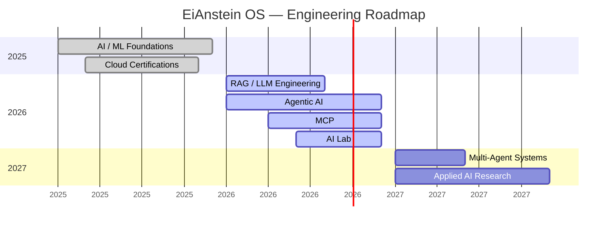

<div align="center">


<br/>


<br/><br/>


<br/><br/>


<br/><br/>

<a href="#-2--introducción--whoami">

</a>

<a href="#-9--featured-projects">

</a>

<a href="#-10--interactive-playground">

</a>

<a href="#-16--contacto">

</a>

</div>

<br/>

---

<details>
<summary><b>📂 system_index.map</b> — Tabla de contenidos</summary>

<br/>

|  #  | Módulo                                                   | Descripción          |
| :-: | :------------------------------------------------------- | :------------------- |
|  01 | [Hero Banner](#-1--hero-banner)                          | Sistema de arranque  |
|  02 | [whoami](#-2--introducción--whoami)                      | Perfil profesional   |
|  03 | [Recruiter Mode](#-3--recruiter-mode)                    | Acceso rápido        |
|  04 | [Mission Brief](#-4--mission-brief)                      | Resumen profesional  |
|  05 | [Current Mission](#-5--current-mission)                  | Misión activa        |
|  06 | [Skill Tree](#-6--skill-tree)                            | Progresión técnica   |
|  07 | [Technologies](#-7--tecnologías)                         | Stack                |
|  08 | [Certifications](#-8--certificaciones)                   | Credenciales         |
|  09 | [Featured Projects](#-9--featured-projects)              | Proyectos destacados |
|  10 | [Interactive Playground](#-10--interactive-playground)   | Experiencia jugable  |
|  11 | [Mission Control](#-11--mission-control)                 | Actividad            |
|  12 | [AI Lab](#-12--ai-lab)                                   | Investigación        |
|  13 | [Ecosystem](#-13--ecosystem)                             | Ecosistema           |
|  14 | [Timeline](#-14--timeline)                               | Roadmap              |
|  15 | [Engineering Principles](#-15--engineering-principles)   | Filosofía            |
|  16 | [Contact](#-16--contacto)                                | Contacto             |
|  17 | [La Hechicera del Código](#-17--la-hechicera-del-código) | Proyecto educativo   |

</details>

<br/>

# ⚡ 1 · Hero Banner

```bash
[ EiAnstein-OS ] boot_sequence.sh --verbose

[ 0.001s ] Loading kernel modules ................ [ OK ]
[ 0.043s ] Mounting /home/isela/knowledge ........ [ OK ]
[ 0.112s ] Initializing neural_core.py ........... [ OK ]
[ 0.198s ] Calibrating LLM inference engine ...... [ OK ]
[ 0.276s ] Starting recruiter_mode.daemon ......... [ OK ]
[ 0.301s ] Verifying credentials & certifications . [ OK ]
[ 0.355s ] Establishing secure API connection ..... [ OK ]

SYSTEM READY.
```

<br/>

# 💻 2 · Introducción · `whoami`

<div align="center">


</div>

```yaml
user:        Isela
role:        Software Engineer · AI Engineer
focus:       Artificial Intelligence Systems & Applied Neural Networks

core_stack:
  - Python
  - FastAPI
  - LLMs
  - RAG
  - LangChain
  - LangGraph
  - MCP
  - Cloud

mission:
  "Diseñar e implementar sistemas de IA robustos,
   explicables y preparados para producción."

status:      ONLINE — Open to new opportunities
```

```bash
isela@eianstein-os:~$ echo "Construyendo inteligencia artificial con propósito."

> Construyendo inteligencia artificial con propósito.
```

---

# 🛰️ 3 · Recruiter Mode

<details>
<summary><b>▶ Ejecutar recruiter_mode.sh</b> — acceso rápido</summary>

<br/>

```bash
isela@eianstein-os:~$ ./recruiter_mode.sh

┌──────────────────────────────────────────────────────┐
│                EiAnstein OS · MENU                    │
├──────────────────────────────────────────────────────┤
│                                                      │
│  [1] PROJECTS   → Ver proyectos destacados           │
│  [2] RESUME     → Experiencia profesional             │
│  [3] AI LAB     → Explorar experimentos               │
│  [4] PLAY       → Entrar a ÑUHU                       │
│  [5] CONTACT    → Contactar a Isela                   │
│                                                      │
└──────────────────────────────────────────────────────┘
```

### Recruiter Quick Scan

| Área                           |     Nivel     |
| :----------------------------- | :-----------: |
| AI Engineering                 |    `ACTIVE`   |
| Python                         |   `UNLOCKED`  |
| Backend / APIs                 |    `ACTIVE`   |
| LLM / RAG                      |    `ACTIVE`   |
| Agentic AI                     | `IN PROGRESS` |
| Cloud                          |    `ACTIVE`   |
| Software Architecture          |    `ACTIVE`   |
| Product / Technical Leadership |    `ACTIVE`   |

</details>

<br/>

---

# 📡 4 · Mission Brief

> **Software Engineer focused on AI systems and applied intelligent technologies.**

* Diseñando y construyendo sistemas de Inteligencia Artificial de extremo a extremo.
* Desarrollo de APIs y servicios backend con Python y FastAPI.
* Experiencia trabajando con LLMs, RAG y arquitecturas de agentes.
* Exploración de LangChain, LangGraph y Model Context Protocol.
* Construcción de soluciones orientadas a casos de uso reales.
* Experiencia con cloud, contenedores y automatización.
* Background de más de una década en software, transformación digital, producto y tecnología.
* Enfoque en código mantenible, arquitectura, seguridad y experiencia de usuario.

<br/>

---

# 🎯 5 · Current Mission

<table width="100%">
<tr>
<td>

```yaml
mission:       "Build Agentic AI Systems"

version:       v2.4.0-beta

progress:      ▓▓▓▓▓▓▓▓▓▓▓▓░░░░░░░░  58%

current_focus:
  - LLM Engineering
  - Agentic AI
  - RAG
  - Cloud Architecture
  - AI Systems

next_release:
  "Multi-Agent Orchestration"

roadmap:
  - [x] AI / ML foundations
  - [x] Cloud foundations
  - [x] RAG architecture
  - [x] API development
  - [x] MCP exploration
  - [ ] LangGraph orchestration
  - [ ] Agent observability
  - [ ] Technical case studies

status:        🟢 ACTIVE
```

</td>
</tr>
</table>

<br/>

---

# 🌳 6 · Skill Tree

<div align="center">

### 🌱 FOUNDATIONS


<br/>

### 🤖 AI ENGINEERING


<br/>

### 🧠 AGENTIC AI


</div>

<br/>

### Skill Status

|      Estado      | Significado                                 |
| :--------------: | :------------------------------------------ |
|   🟢 `UNLOCKED`  | Dominio consolidado y aplicado en proyectos |
| 🟡 `IN PROGRESS` | Aprendizaje activo y experimentación        |
|    🔴 `LOCKED`   | Próximo nivel / pendiente de desbloqueo     |

> **The tree is never finished. It evolves with every project.**

<br/>

---

# 🧩 7 · Tecnologías

<div align="center">

### Languages


### AI / Machine Learning


### LLM / Agentic AI


### Backend & APIs


### Cloud & Infrastructure


### Data


</div>

<br/>

---

# 🎓 8 · Certificaciones

<div align="center">

| Emisor                                                                                                      | Certificación                                       | Estado |
| :---------------------------------------------------------------------------------------------------------- | :-------------------------------------------------- | :----: |
|       | Engineer AI Agents with Agent Development Kit (ADK) |    ✅   |
|                | Fundamentos de Inteligencia Artificial / Guayerd    |    ✅   |
|       | Oracle Cloud Foundations Associate                  |    ✅   |
|  | AWS Cloud Practitioner Essentials                   |    ✅   |
|          | Ethical Hacker                                      |    ✅   |

</div>

<br/>

---

# 🚀 9 · Featured Projects

## 🧠 CorpIA

> AI-powered enterprise knowledge assistant.

```text
Architecture

PDF Documents
      │
      ▼
Document Loader
      │
      ▼
Chunking
      │
      ▼
Embeddings
      │
      ▼
Vector Database
      │
      ▼
Retriever
      │
      ▼
LLM
      │
      ▼
AI Assistant
```

**Stack**


<a href="https://github.com/IselaDataMaven/CorpIA">

</a>

---

## 🌿 Lumi Wellness

> Digital wellness platform combining habit tracking, progress visualization and an AI conversational companion.

**Focus**

`AI UX` · `Conversational AI` · `Data Visualization` · `Scalable Architecture`

<a href="https://github.com/IselaDataMaven/Lumi_Wellness">

</a>

---

## 🐉 ÑUHU Resonance

> AI-driven dragon sanctuary exploring sound, interaction, accessibility and immersive digital experiences.

**Core concepts**

`Interactive AI` · `Three.js` · `Audio Interaction` · `Accessibility` · `VR` · `Privacy by Design`

<a href="#-10--interactive-playground">

</a>

<br/><br/>

---

# 🎮 10 · Interactive Playground

<div align="center">

# 🐉 Ñ U H U

### RESONANCE DRAGON SANCTUARY


<br/><br/>

<a href="TU_URL_DE_GITHUB_PAGES_DE_NUHU">


</a>

<br/><br/>

</div>

```text
                 .-""""-.
              .-'  🐉    '-.
            .'   Ñ U H U     '.
           /                   \
          ;     RESONANCE       ;
          |      SANCTUARY      |
          ;                     ;
           \                   /
            '.               .'
              '-._________.-'

        LISTEN · BREATHE · EXPLORE · RESONATE
```

### Experience

ÑUHU is an experimental interactive environment designed around:

* 🐉 Dragon-based exploration
* 🎵 Musical interaction
* 🌌 Sanctuary environments
* 🫧 Breathing / resonance mechanics
* ♿ Accessibility-oriented interaction
* 🎮 Game-like progression
* 🥽 VR exploration
* 🔐 Privacy-first architecture

> **No biometric data storage.**
> The experience is designed around interaction rather than permanent biometric profiling.

### Progression

```text
AURA MUSICAL SANCTUARY
          │
          ▼
     RESONANCE
          │
          ▼
   DRAGON SANCTUARY
          │
          ▼
  🐉 ÑUHU DRAGON SANCTUARY VR
          │
          ▼
      NEXT LEVEL
```

**Play the experience →**

<a href="TU_URL_DE_GITHUB_PAGES_DE_NUHU">

</a>

<br/>

---

# 🖥️ 11 · Mission Control

<div align="center">


</div>

<br/>

```text
┌──────────────────────────────────────────────────────┐
│                  MISSION CONTROL                     │
├──────────────────────────────────────────────────────┤
│                                                      │
│  AI ENGINEERING              ● ACTIVE                │
│  SOFTWARE ARCHITECTURE       ● ACTIVE                │
│  CLOUD                       ● ACTIVE                │
│  RAG                         ● ACTIVE                │
│  AGENTIC AI                  ◐ BUILDING              │
│  COMPUTER VISION             ◐ RESEARCH              │
│                                                      │
└──────────────────────────────────────────────────────┘
```

<br/>

---

# 🧪 12 · AI Lab

```text
┌──────────────────────────────────────────────────────────────┐
│                    AI LAB                                    │
│            EXPERIMENTAL / RESEARCH BRANCH                    │
├──────────────────────────────────────────────────────────────┤
│                                                              │
│  Agentic AI             🧪 Research                          │
│  Computer Vision        🧪 Research                          │
│  RAG / Retrieval        🧪 Research                          │
│  LLM Engineering        🧪 Research                          │
│  AI UX                  🧪 Experimental                      │
│                                                              │
└──────────────────────────────────────────────────────────────┘
```

| Experiment          |     Category    |      Status     |
| :------------------ | :-------------: | :-------------: |
| Agent architectures |    Agentic AI   |   🧪 Research   |
| Vision experiments  | Computer Vision |   🧪 Research   |
| Retrieval systems   | RAG / Retrieval |   🧪 Research   |
| AI interaction      |      AI UX      | 🧪 Experimental |

> **The laboratory is where ideas become systems.**

<br/>

---

# 🌐 13 · Ecosystem

```text
                              ┌───────────────────────────┐
                              │       EiAnstein OS        │
                              │     AI ENGINEERING HUB    │
                              └──────────────┬────────────┘
                                             │
        ┌──────────────────────┬────────────┼─────────────┬──────────────────┐
        │                      │            │             │                  │
        ▼                      ▼            ▼             ▼                  ▼
 ┌──────────────┐       ┌──────────┐  ┌──────────┐  ┌──────────┐      ┌───────────┐
 │  Portfolio   │       │  CorpIA  │  │  ÑUHU    │  │ AI Lab   │      │  GitHub   │
 │              │       │          │  │Resonance │  │          │      │           │
 └──────────────┘       └──────────┘  └──────────┘  └──────────┘      └─────┬─────┘
                                                                              │
                                                                      ┌───────┴───────┐
                                                                      │               │
                                                                      ▼               ▼
                                                                  YouTube         Articles
```

<br/>

---

# 🗓️ 14 · Timeline


```mermaid
gantt
    title EiAnstein OS — Engineering Roadmap
    dateFormat YYYY-MM
    axisFormat %Y

    section 2025
    AI / ML Foundations             :done, t1, 2025-01, 2025-12
    Cloud Certifications            :done, t2, 2025-03, 2025-11

    section 2026
    RAG / LLM Engineering            :active, t3, 2026-01, 2026-08
    Agentic AI                       :active, t4, 2026-01, 2026-12
    MCP                              :active, t5, 2026-04, 2026-12
    AI Lab                           :active, t6, 2026-06, 2026-12

    section 2027
    Multi-Agent Systems              :t7, 2027-01, 2027-06
    Applied AI Research              :t8, 2027-01, 2027-12
```

<br/>

---

# 🧭 15 · Engineering Principles

<div align="center">

| Principle                     | Engineering Philosophy                                                     |
| :---------------------------- | :------------------------------------------------------------------------- |
| **Clarity over complexity**   | Systems should be understandable by the next engineer.                     |
| **Responsible AI**            | AI systems should be explainable, auditable and conscious of their limits. |
| **Production over demos**     | A model is not finished until it can be deployed and maintained.           |
| **Measurable iteration**      | Improvements should be validated with evidence and metrics.                |
| **User-centered engineering** | Technology matters when it solves a real problem.                          |
| **Fail fast, learn faster**   | Experiments exist to validate hypotheses.                                  |
| **Security by design**        | Privacy and security belong in the architecture from day one.              |

</div>

<br/>

---

# 📡 16 · Contacto

<div align="center">

### Open to new opportunities

<br/>

<a href="https://www.linkedin.com/in/iselalgarcia/">

</a>

<a href="https://github.com/IselaDataMaven">

</a>

<br/><br/>

```text
┌────────────────────────────────────────────────────┐
│                                                    │
│  AI ENGINEER                                      │
│  SOFTWARE ENGINEERING                             │
│  CLOUD · LLM · RAG · AGENTIC AI                   │
│                                                    │
│  STATUS: ● OPEN TO OPPORTUNITIES                  │
│                                                    │
└────────────────────────────────────────────────────┘
```

</div>

<br/>

---

# 🧙‍♀️ 17 · La Hechicera del Código

<div align="center">

```text
╔══════════════════════════════════════════════════════════════╗
║                 LA HECHICERA DEL CÓDIGO                     ║
╠══════════════════════════════════════════════════════════════╣
║ STATUS        ● ONLINE                                      ║
║ PROJECT       La Hechicera del Código                       ║
║ TYPE          Educational / Technology                      ║
║ MISSION       Compartir conocimiento tecnológico            ║
╚══════════════════════════════════════════════════════════════╝
```

### ✨ Un proyecto para compartir conocimiento

**La Hechicera del Código** es un espacio para compartir conocimiento, despertar curiosidad y acercar a más personas al mundo de la tecnología.

Programación · Inteligencia Artificial · Ingeniería de Software · Historia de la Tecnología · Cloud · Experimentos

<br/>

# **FELIZ VIAJE HACIA EL CÓDIGO**

<br/>

<a href="https://www.youtube.com/@lahechiceradelcodigo">

</a>

<a href="https://medium.com/@lahechiceradelcodigo">

</a>

<a href="https://lahechiceracodigo.github.io">

</a>

<a href="https://github.com/LaHechiceraCodigo">

</a>

<a href="https://www.tiktok.com/@lahechiceradelcodigo">

</a>

<br/><br/>

### 💙 Gracias por visitar el sistema.

**FELIZ VIAJE HACIA EL CÓDIGO.**

<br/>

<sub>「 Diseñando inteligencia con propósito, un sistema a la vez. 」</sub>

</div>
